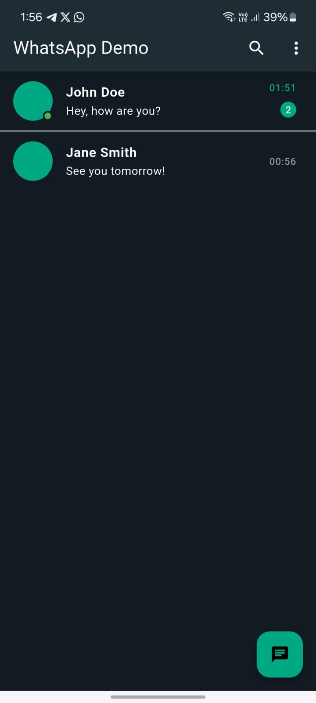
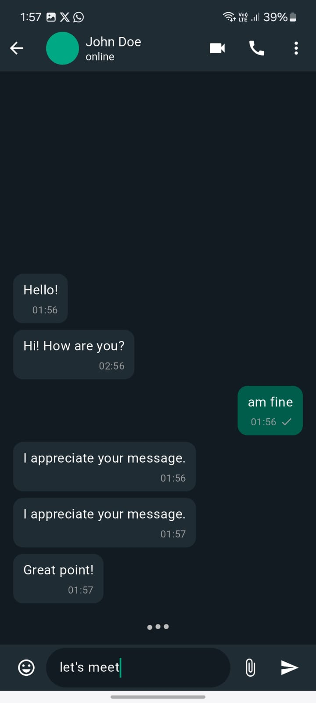
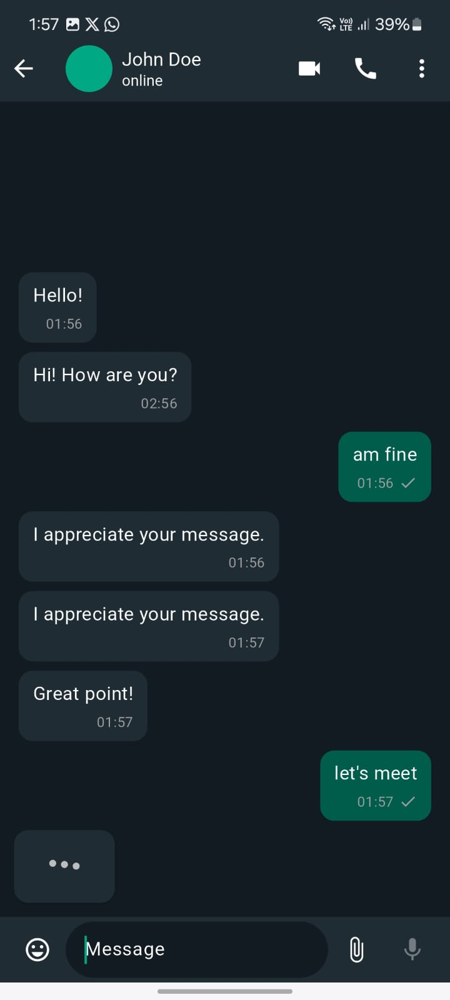

# Flutter WhatsApp Demo Clone

<p align="center">
  
  
  
</p>

A WhatsApp-like demo chat application built with Flutter and Provider for state management. This project serves as a demonstration of UI implementation and chat functionality simulation.

## Features

- 📱 Clean, modern WhatsApp-inspired UI
- 💬 Real-time chat simulation
- ✨ Automated response system
- 🔄 Provider state management
- 📝 Typing indicators
- ✔️ Message status (sent, delivered, read)
- ⌚ Message timestamps
- 🎨 Dark theme
- 🏃‍♂️ Smooth animations

## Getting Started

### Prerequisites

- Flutter SDK (3.0.0 or higher)
- Dart SDK (3.0.0 or higher)
- Android Studio / VS Code with Flutter extensions

### Installation

1. Clone the repository:
```bash
git clone https://github.com/yourusername/whatsapp_demo.git
```

2. Navigate to project directory:
```bash
cd whatsapp_demo
```

3. Install dependencies:
```bash
flutter pub get
```

4. Run the app:
```bash
flutter run
```

## Project Structure

```
lib/
├── main.dart
├── models/
│   ├── chat.dart
│   └── message.dart
├── providers/
│   └── chat_provider.dart
├── screens/
│   ├── home_screen.dart
│   └── chat_screen.dart
├── utils/
│   ├── date_formatter.dart
│   └── auto_reply_generator.dart
├── widgets/
│   ├── message_bubble.dart
│   └── typing_indicator.dart
└── theme/
    └── app_theme.dart
```

## State Management

The app uses Provider for state management. The `ChatProvider` class handles:
- Message history
- Chat list management
- Automated replies
- Typing status
- Message status updates

## Automated Replies

The demo implements an automated reply system that:
- Simulates realistic typing delays
- Provides contextual responses
- Shows typing indicators
- Manages message status updates

## UI Components

### Home Screen
- Recent chats list
- Unread message counts
- Last message preview
- Timestamp
- Online status indicators

### Chat Screen
- Message bubbles
- Typing indicators
- Input field with send button
- Message status indicators
- Timestamps

## Theme

The app uses a dark theme similar to WhatsApp with:
- Primary color: `#075E54`
- Accent color: `#00A884`
- Background: `#121B22`
- Surface: `#1F2C34`

## Contributing

1. Fork the repository
2. Create your feature branch (`git checkout -b feature/AmazingFeature`)
3. Commit your changes (`git commit -m 'Add some AmazingFeature'`)
4. Push to the branch (`git push origin feature/AmazingFeature`)
5. Open a Pull Request

## License

This project is licensed under the MIT License - see the [LICENSE.md](LICENSE.md) file for details

## Acknowledgments

- Inspired by WhatsApp's UI/UX
- Built with Flutter and Provider
- Created as a demonstration project

## Author

**Ramy Magdy** - *Initial work*

Last Updated: 2025-03-15 23:56:05 UTC